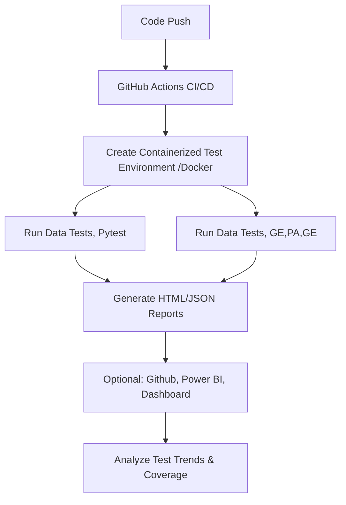

# ⚡GENAI Automation Demo 


## 🛰 Overview

This project demonstrates a **GenAI QA Automation Workflow** for modern web applications:

**🌐 Hypothesis**: Property-based testing for text and data processing.<br>
**🔍 Great Expectations**: Automated data validation ensuring dataset quality and consistency.<br>
**🐼 Pandas:** Data manipulation, filtering, and analysis once the dataset is validated.<br>
**🐳 Docker**: Containerized, reproducible, and isolated development & testing environment.<br>
**⚙️ CI/CD Integration**: GitHub Actions running automated tests on every push.<br>
**📊 Reporting & Analytics**: HTML/JSON reports, with future integration into Power BI dashboards.<br>
**🎯 Goal**: Showcase end-to-end GenAI QA engineering skills — from test design to automated execution on the cloud.


## 🧩 Tech Stack

| Component         | Technology                          | 
|-------------------|-------------------------------------|
| Language          | Python 3.11                         |
| Test Framework    | Pytest                              |
| Automation        | Hypothesis;GreatExpectations        |
| DataTesting       | Polaris/Pandas                      |
| API Testing       | Requests + Pytest                   |
| Containerization  | Docker, Kubernets                   |
| CI/CD             | GitHub Actions                      |
| Reporting         | Pytest HTML & JSON, Power BI(opt.)  |


## 🚀 Project Structure
```
📦 `.github/`
├── workflows/
│   └── python-test.yml   # CI/CD workflow

├── data/
│   └── sample_data.csv   # CI/CD workflow

🧪 `tests/`
├── test_data_pa.py              # Automation tests Pandas/Polaris
├── test_great_expectations.py   # GenAI data validation testing
├── test_hypothesis_demo         # GenAI proprety tests 
└── conftest.py                  # Shared fixtures

📊 `docs/report.html`    # Test reports (HTML/JSON)
📄 `README.md`           # Project documentation
```

## 🧪 Running Tests Localy
```bash
pip install -r requirements.txt #install dependencies 
python -m venv venv #create virutal envionment 
.\venv\Scripts\Activate.ps1  # Windows PowerShell
pytest --html=docs/report.html --self-contained-html #Run test and generate reports
```

## ⚙ Workflow Diagram



## 📊 Reporting & Dashboard

Pytest HTML reports generated on every run. [Download](https://github.com/nadreal/genai-automation-demo/actions/runs/17239640429/artifacts/3853647875)<br>
[](https://github.com/nadreal/genai-qa-automation-demo/actions/workflows/web-automation-demo.yml)<br>
[](https://nadreal.github.io/genai-qa-automation-demo/)<br>
HTML/JSON output ready for ingestion into Power BI or other dashboards. 📄 [View Test Report](https://nadreal.github.io/genai-automation-demo/report.html)<br>
Future plans: Interactive QA dashboard to visualize pass/fail trends, API coverage, and flaky test detection.<br>

## 👨‍🚀 Author

Stevan Grubac [](https://linkedin.com/in/yourusername) <br>
💻 Software Engineer | QA | DevOps<br>
🧠 Focus: Automation, CI/CD, Scalable Testing, DevOps<br>

